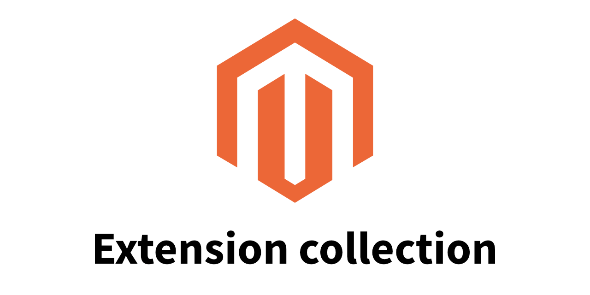

# Magento E-Commerce CE - Extension collection

- [About](#about)
- [Extensions](#extensions)
  - [CmsPhp](#cmsphp)
  - [CrontabJobs](#crontabjobs)
  - [PaymentFree](#paymentfree)
  - [SecureCartURL](#securecarturl)
- [How to use](#how-to-use)
- [License »](/LICENSE.md)

---

[](https://github.com/TheRemoteCoder/Magento-Ecommerce-CE--Extension-Collection/releases)

<br>


## About

This is a collection of a few straightforward to use Magento CE extensions. They have been developed for `Magento CE 1.4 – 1.6` but might work with wider ranges of versions (e.g. these extensions don't use the Database to keep it simple).

They are especially useful for Community Edition setups when time and budget are low or installation of other extensions is not an option. Also it's sometimes the case that complex commercial extensions come with alot more issues too.


<br><br>

## Extensions

### CmsPhp

_Magento CE 1.4. – 1.6._

Use to redirect to any URI within this shop or to external resources. Block can be used safely in:

| Module           | Block type |
| :--------------- | :--------- |
| catalog_category | XML        |
| catalog_product  | XML        |
| cms_block        | HTML       |
| cms_page         | HTML, XML  |

<br>

CMS variable: `{{block type="TheRemoteCoder_cmsphp/redirect" target="http://example.com/"}}`

<br>

XML layout update:

```xml
<block type="TheRemoteCoder_cmsphp/redirect" name="example">
    <action method="redirectXml"><url>http://example.com/</url></action>
</block>
```

<br>

### CrontabJobs

_Magento CE 1.5._

Overrides and extends unimplemented core settings of Magento CE; so this is considered a fix too. Some cronjobs just don't work, even with backend options for them, because there are a few important XML settings missing. For convenience all have been grouped in one place to be easiliy modified.

> It's highly recommended to install the *Noovias Cronjob Manager* extension to see if the XML changes actually work (and it is a very good extension in general).

Last but not least a cronjob needs to be set up serverside too. Alternative: Call `cron.php` manually from the browser, e.g. for testing purposes.


<br>

### PaymentFree

_Magento CE 1.6._

This extension lets customers leave the shop without any payment information but a valid, generated invoice. Even if the invoice is at a zero balance it's needed for taxes and own records. A suited use case can be wholesale customers with a payment contract (direct debit) which is handled in a separate process or system.

**Example workflow for inspiration:**

> Either the customer itself or some of the shops employees create the order in the shop frontend for the customer. So why do employees need to use the frontend? Imagine the shop is used in multiple countries with different partners: Not everyone knows how to use Magento or should have access to the admin panel - even with restricted ACL rights. The frontend provides an easy way to handle these special B2B customers.

Make sure to test this carefully before implementation or everyone might get unwanted freebies ;)

<br>
Additional docs and screenshots can be found here:

- `PaymentFree\app\code\local\PaymentFree\Docs`

`Mage::log()` items have been left in the class `TheRemoteCoder_PaymentFree_Model_PaymentFree` on purpose (commented out) for testing purposes before implementation.


<br>

### SecureCartURL

_Magento CE 1.5. - 1.6._

Rather a fix: Set the URL `/checkout/cart` to be a `secure_url`. There is no `https://` protocol in this step by default. To make this work changes to the URLs in the admin panel are required.


<br><br>

## How to use

Just download the folders and copy them to the right place. They all will install into the local scope.

### Installation

1. Download the folders but don't install them yet.
2. Open your shops Magento admin panel.
3. Make sure the Compiler is disabled before changing things under `/app/`.
4. Disable the caches if possible.
5. Copy the files into the `/app/` folder.
6. Clean the caches.
7. If installed correctly they should appear in the admin panel in the part where you can enable/disable all modules.
8. See if the module appears and the pages are working (depending on the code; check both frontend and backend).
9. Check if the logs are ok under `/var/logs/`.
10. (Test and deploy)

